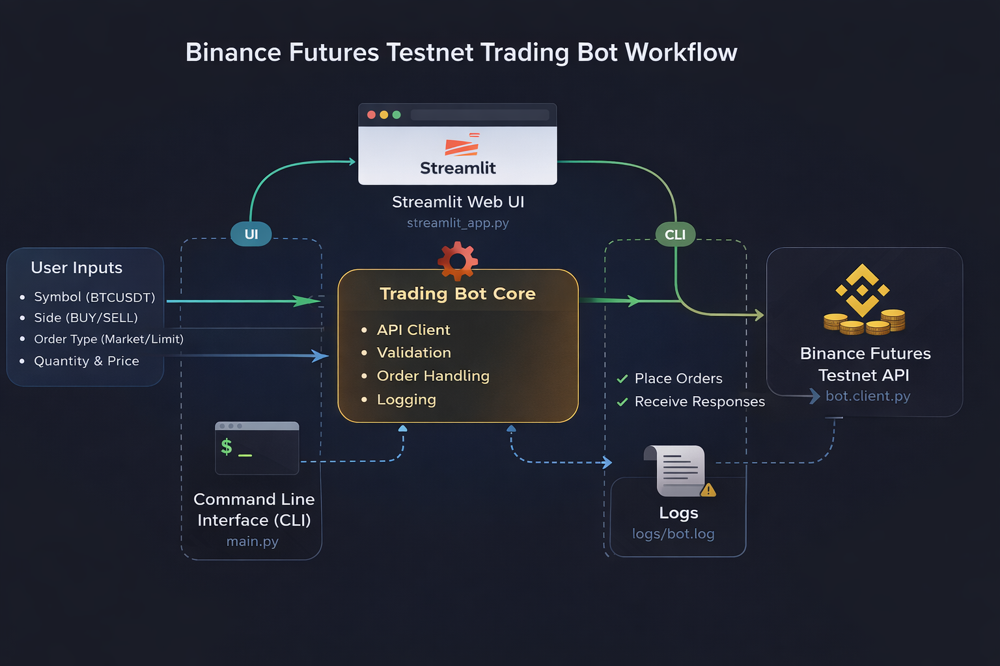

# Binance Futures Testnet Trading Bot

A simple Python trading bot that places **Market and Limit orders** on **Binance Futures Testnet**.

The project supports two interfaces:
* **Streamlit Web UI**
* **Command Line Interface (CLI)**

---

## Setup

1. Clone the repository

```bash
git clone <repo-url>
cd trading_bot
```

2. Install dependencies

```bash
pip install -r requirements.txt
```

3. Create a `.env` file in the project root

```
BINANCE_API_KEY=your_api_key
BINANCE_API_SECRET=your_api_secret
```

Generate API keys from:

https://testnet.binancefuture.com

---

## Run Streamlit UI

```bash
streamlit run streamlit_app.py
```

Open in browser:

```
http://localhost:8501
```

The UI allows selecting:
* Symbol
* BUY / SELL
* Market or Limit order
* Quantity
* Price (for Limit orders)

---

## Run CLI

### Market Order

```bash
python main.py --symbol BTCUSDT --side BUY --type MARKET --quantity 0.01
```

### Limit Order

```bash
python main.py --symbol BTCUSDT --side SELL --type LIMIT --quantity 0.01 --price 60000
```

---

## Logs

All API requests and responses are stored in:

```
logs/bot.log
```

---

## Notes

* Works with **Binance Futures Testnet only**
* Uses **test funds (no real trading)**
* Ensure your account has test USDT balance

## Project Flow

